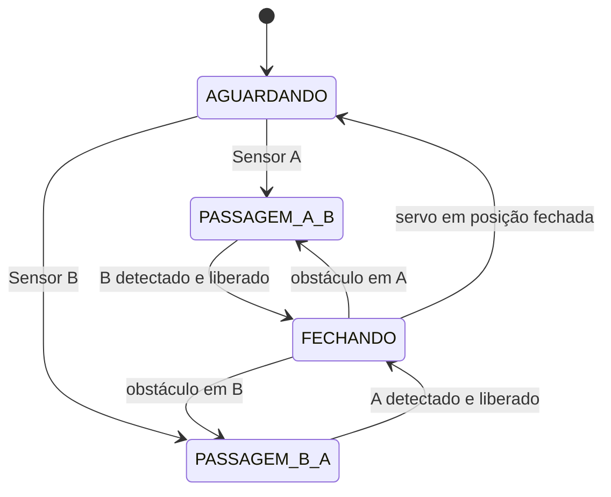

# Arquitetura do SmartGate

## Fluxo físico

```text
Sensor A ─┐                         ┌─ Sensor B
          ├─> Arduino Uno ─> Servo ─┤
          │       │                 │
          │       ├─> LED RGB       │
          │       └─> Buzzer        │
          └──── lógica de direção ──┘
```

## Estados



## Decisões

- `millis()` controla temporização do servo, alertas e sensores sem travar o loop principal.
- `pulseIn()` permanece com timeout curto porque o HC-SR04 depende do tempo de voo do eco.
- A direção é preservada em um `enum class Estado`, evitando números mágicos.
- O sensor do lado oposto precisa ser detectado e depois liberado antes do fechamento.
- Durante o fechamento, uma nova detecção provoca reabertura.
- Existe timeout de passagem para impedir que o ciclo permaneça indefinidamente aberto.

## Limites de segurança

O projeto é um protótipo didático. HC-SR04 e microservo não substituem fotocélulas certificadas, fins de curso, relés de segurança, redundância ou mecanismos mecânicos adequados a uma cancela real.
